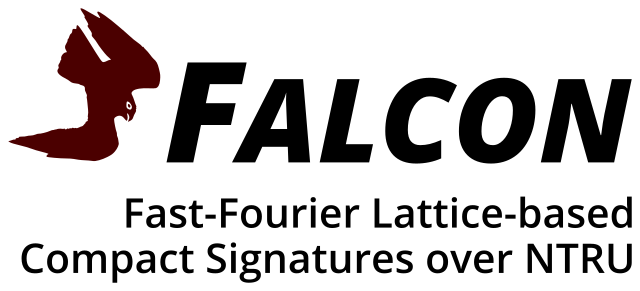

# falcon-cli 4 post-quantum file sigs

Post-quantum cryptography is being developed, benchmarked, tested, discussed, and elaborated... Let me join in on that with a little practical software piece. [`falcon-cli`](https://github.com/chiefbiiko/falcon-cli) is a CLI tool to sign and verify files with the post-quantum signature scheme [FALCON](https://falcon-sign.info/), a round 3 finalist for digital signature algorithms in NIST's post-quantum cryptography standardization competition.

The tool supports keygen, file sign and verify ops, as such it is complete and ready for common file signature use cases. Imagine - now you can sign your Github Releases with (probably) post-quantum safe signatures and chill (4ever)...

Usage should be straightforward when glimpsin' over the [README](https://github.com/chiefbiiko/falcon-cli/blob/main/README.md). The default key location shouldn't be surprisin' as well: `~/.falcon-cli/(public|secret).key`. Also, if explicit input or output files are omitted, the tool falls back to `stdin` and `stdout` for IO.

In case of any issues get at me on [GitHub](https://github.com/chiefbiiko/falcon-cli/issues).